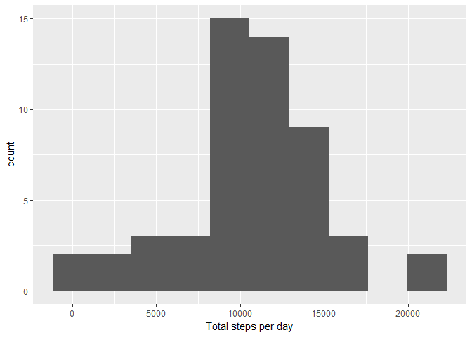
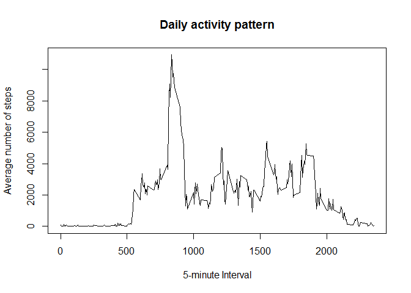
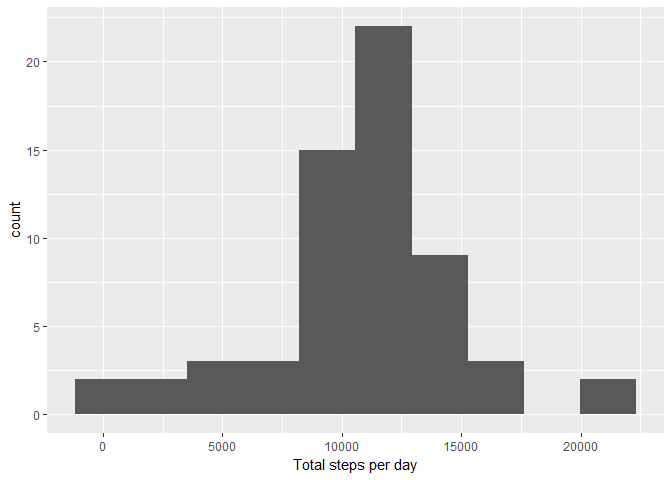
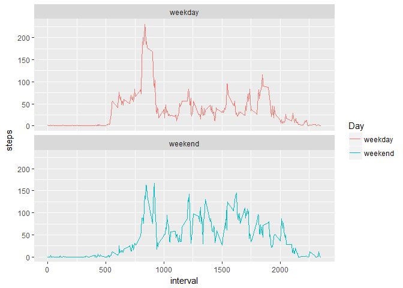

# Reproducible Research: Peer Assessment 1


## Loading and preprocessing the data

Package needed:

```r
library(ggplot2)
library(knitr)
library(dplyr)
```

```
## 
## Attaching package: 'dplyr'
```

```
## The following objects are masked from 'package:stats':
## 
##     filter, lag
```

```
## The following objects are masked from 'package:base':
## 
##     intersect, setdiff, setequal, union
```

```r
library(lubridate)
```

```
## 
## Attaching package: 'lubridate'
```

```
## The following object is masked from 'package:base':
## 
##     date
```

```r
opts_chunk$set(echo = TRUE, results = "asis")
```

File zip verification. If the zip file exist, unzip it and read the data:

```r
if(file.exists("activity.zip")){
	activity <- read.csv(unzip("activity.zip"))
}
```

Transforme Dates in Date formate

```r
activity$date <- ymd(activity$date)
```

## What is mean total number of steps taken per day?
Calculate the total number of steps taken per day
(ignore the missing values)

```r
steps <- activity %>%
         group_by(date) %>%
         summarize(steps = sum(steps))
```

Plot the histogramm of the total number of steps taken per day


```r
qplot(steps, data = steps, xlab = "Total steps per day", bins = 10)
```

```
## Warning: Removed 8 rows containing non-finite values (stat_bin).
```

<!-- -->

The following code:

```r
mean <- mean(steps$steps, na.rm = TRUE)
median <- median(steps$steps, na.rm = TRUE)
total <- sum(steps$steps, na.rm = TRUE) 
```
allows to obtain the mean, 1.0766189\times 10^{4}, and median, 10765, values of the total number of steps taken per day and the total number of steps, 570608.

## What is the average daily activity pattern?

Calculate the total number of steps in each 5-minutes interval across all days:

```r
stepsInterval <- activity %>%
         filter(!is.na(steps)) %>%
         group_by(interval) %>%
         summarize(steps = sum(steps))
```

A time series plot of the 5-minute interval and the average number of steps: 

```r
plot(stepsInterval$interval, stepsInterval$steps, type = "l", xlab = "5-minute Interval", ylab = "Average number of steps", main = "Daily activity pattern")
```

<!-- -->

The following code:

```r
max <- stepsInterval[which.max(stepsInterval$steps),]
```
allows to obtain the interval contains the maximum number of steps on average across all the days in the dataset, which is: 835

## Imputing missing values

The  total number of missing values (total number of rows with NAs):

```r
totalNA <- sum(is.na(activity$steps))
```
is 2304.

The mean value of steps for a 5-minute interval is used to fill in the NAs in original dataset.


```r
stepsMean <- activity %>%
         filter(!is.na(steps)) %>%
         group_by(interval) %>%
         summarize(steps = mean(steps))

notNA <- activity

for (i in 0:60){
    for (j in 1:288){
      k<- i*288+j
      if (is.na(notNA$steps[k])){
          notNA$steps[k] <- stepsMean$steps[j]  
      }
    }
}
```
Calculate the total number of steps taken per day


```r
stepsNA <- notNA %>%
           group_by(date) %>%
           summarize(steps = sum(steps))
```
Plot the histogramm of the total number of steps taken per day


```r
qplot(steps, data = stepsNA, xlab = "Total steps per day", bins = 10)
```

<!-- -->

The following code:

```r
meanNA <- mean(stepsNA$steps, na.rm = TRUE)
medianNA <- median(stepsNA$steps, na.rm = TRUE)
totalNA <- sum(stepsNA$steps, na.rm = TRUE)
stepsDiffer <- totalNA - total
```
allows to obtain the mean, 1.0766189\times 10^{4}, and median, 1.0766189\times 10^{4}, values of the total number of steps taken per day with imputed missing values. The mean do not differ from the mean value without impute missing values, 1.0766189\times 10^{4}, as we use mean for replace NAs. But addition values increased the  median in comparing with calculated without imputed missind values, 10765.
Total number of steps 6.5673751\times 10^{5} increases in comparison with number of steps without impute, 570608 on 8.6129509\times 10^{4} steps.

## Are there differences in activity patterns between weekdays and weekends?

Create a new factor variable in the dataset with two levels - "weekday" and "weekend" indicating whether a given date is a weekday or weekend day.

Note! I use the german version, for english version "Samstag" and "Sonntag" in code should be replaced with "Saturday" and "Sunday"


```r
notNA$Day <- ifelse(weekdays(notNA$date) == "Samstag" | weekdays(notNA$date) == "Sonntag", "weekend", "weekday")
notNA$Day <- as.factor(notNA$Day)
```

Calculate the average steps in the 5-minute interval for weekday and weekend


```r
intervalDay <- notNA %>%
    group_by(interval, Day) %>%
    summarise(steps = mean(steps))
```

Use ggplot for making the time series of the 5-minute interval for weekday and weekend, and compare the average steps:


```r
ggplot(intervalDay, aes(interval, steps, color = Day)) + geom_line() +facet_wrap(~Day, ncol = 1, nrow=2)
```

<!-- -->

Plots above shows less activity on early mornings on weekends but more activity during the day long.
